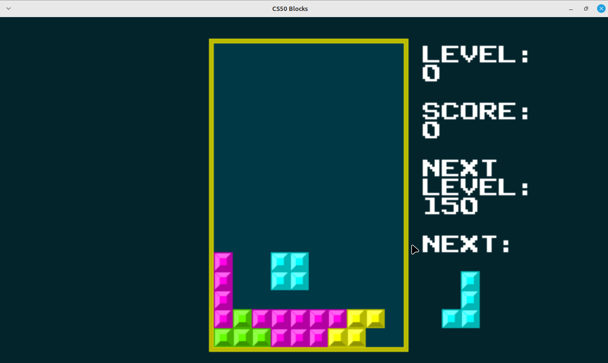

# Blocks (Tetris clone)



## Technology:
* [Lua](https://www.lua.org/)
* [Love2D](https://love2d.org/)

## About the project:
This is a recreation of tetris, made with Lua programming language and Love2D which is a free, open-source and multi-platform framework for making 2D games. This game was my final project for [CS50's Introduction to Game Development](https://cs50.harvard.edu/games/2018/).

## How to run:
### Windows
* Download the appropriate release file
* Unzip the file and run blocks.exe

### Linux
* First you must make sure that you have Love2D installed. Love2D is commonly available as part of many distributions repositories. On Debian-based systems you can install it with: 
```
sudo apt install love
```
* Download the appropriate release file
* Double click the .love file to run the game. If this doesnt work, right-click the file with your mouse and select Open with > LOVE or open a terminal in the .love file directory and type `love .` 

### Controls:
* Control with arrow keys:
  * UP - rotate block
  * DOWN - drop block
  * LEFT/RIGHT - move block

## Some of the code features:
* State machine
* OOP design
* Tilesets

## Credits:
* timer.lua from [Knife](https://github.com/airstruck/knife) ("A collection of useful micro-modules for Lua")
* class.lua from [hump](https://github.com/vrld/hump) ("LÖVE Helper Utilities for Massive Progression")
* push.lua from [push](https://github.com/Ulydev/push) ("A simple resolution-handling library for LÖVE")
